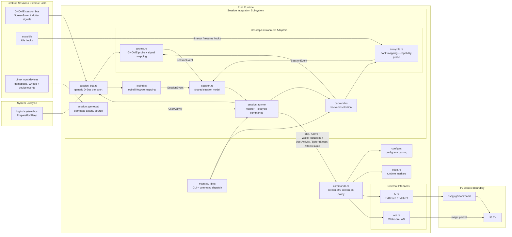

# LG Buddy Architecture Overview

This document describes the current LG Buddy architecture.

It is not a product roadmap. It is a map of what exists today and how the main pieces fit together.

For the top-level system, desktop, and service event paths that enter the
runtime, see [Runtime event handler map](runtime-event-handler-map.md).

## Repository Shape

The repository now has one runtime implementation and one setup surface:

- Rust runtime workspace
  - `Cargo.toml`
  - `crates/lg-buddy/`
- shell-based setup surface
  - `configure.sh`
  - `install.sh`
  - `uninstall.sh`
  - `bin/LG_Buddy_Common`
  - `systemd/`

The Rust runtime owns operational behavior. The remaining shell layer exists for configuration, installation, and removal.

## High-Level Runtime Shape

The Rust crate is organized as a small core with explicit boundaries:

```text
main.rs
  -> lib.rs
     -> parse CLI arguments
     -> dispatch command
        -> commands.rs
           -> config.rs
           -> state.rs
           -> tv.rs
           -> wol.rs
           -> backend.rs
           -> session.rs / session/inactivity.rs / session/gamepad/ / gnome.rs / swayidle.rs / logind.rs
```

## System Diagram

The current runtime can be visualized as desktop and system event paths into the
Rust runtime, and then one control path from policy code into the TV transport
boundary.



The intended split is:

- `lib.rs`
  - public entry surface for the binary
  - command parsing
  - shared error types
- `commands.rs`
  - lifecycle policy
  - startup, shutdown, pre-sleep, screen-off, screen-on flows
  - orchestration of config, state, TV control, and Wake-on-LAN
- `config.rs`
  - config path resolution
  - parsing of the existing `config.env` format
  - typed values for HDMI input, backend, MAC address, and idle timeout
- `state.rs`
  - runtime directory resolution
  - system/session state separation
  - ownership marker management
- `tv.rs`
  - TV transport abstraction
  - subprocess-backed `bscpylgtvcommand` client
  - typed facade for input, screen, and power operations
- `wol.rs`
  - native Wake-on-LAN packet generation and UDP send
- `backend.rs`
  - backend selection and detection
  - `auto`, `gnome`, and `swayidle` support
- `session.rs`
  - backend-neutral session event model
  - capability surface for desktop backends
  - top-level event consumption is mapped separately in
    [runtime-event-handler-map.md](runtime-event-handler-map.md)
- `session/inactivity.rs`
  - synthesizes idle and active transitions from provider signals and configured thresholds
  - keeps blank and restore decisions edge-triggered instead of poll-triggered
- `session/gamepad/`
  - discovers readable Linux gamepad-like input devices
  - refreshes discovery from Linux input-device add, remove, and change events
  - periodically reconciles the watched device set in case an event is missed
  - maps raw controller events into activity observations
  - hosts device-specific adapters for supplemental activity surfaces
  - includes a Logitech G923 adapter for raw HID wheel and pedal reports that
    may not appear through evdev
  - detailed in [gamepad-subsystem.md](gamepad-subsystem.md)
- `session_bus.rs`
  - generic blocking D-Bus transport seam
  - session-bus use for the GNOME monitor runtime
  - system-bus use for the logind lifecycle runtime
- `session/runner.rs`
  - backend-neutral monitor and lifecycle runners
  - combines backend observations with the inactivity engine
  - dispatches semantic session events into the existing screen policy commands
- `logind.rs`
  - Linux system lifecycle adapter
  - maps `org.freedesktop.login1` `PrepareForSleep` signals into canonical
    lifecycle events
  - acquires the logind sleep delay inhibitor used by the lifecycle service
- `gnome.rs`
  - GNOME-specific capability probing and event mapping
  - capability probing plus ScreenSaver signal / IdleMonitor method mapping
- `swayidle.rs`
  - `swayidle`-specific capability probing and hook-to-event mapping
  - keeps `swayidle` as an external-tool backend rather than reimplementing
    idle management

The session-facing pieces should be read as one subsystem:

- `backend.rs`
  - selects the active session backend
- `session.rs`
  - defines the homogenized session contract
- `session/inactivity.rs`
  - owns session-phase synthesis from GNOME observations and configured thresholds
- `session/gamepad/`
  - supplies auxiliary user-activity observations for controller input
  - owns gamepad device discovery, event-triggered refresh, and reconciliation
  - see [gamepad-subsystem.md](gamepad-subsystem.md) for adapter and lifecycle details
- `session/runner.rs`
  - consumes normalized session events and idletime observations and dispatches runtime policy
  - owns the `lifecycle` event loop for system sleep/wake handling
- `logind.rs`
  - adapts Linux system lifecycle signals into that shared session contract
- `gnome.rs` and `swayidle.rs`
  - adapt backend-specific surfaces into that shared session contract

## Command Model

The binary currently supports these commands:

- `startup [auto|boot|wake]`
- `shutdown`
- `sleep-pre`
- `sleep`
- `brightness`
- `screen-off`
- `screen-on`
- `monitor`
- `lifecycle`
- `detect-backend`

`lib.rs` parses the command line into a typed command enum and dispatches into
the runtime command handlers in `commands.rs` and `session/runner.rs`.

This keeps CLI parsing separate from operational behavior.

## Core Control Flows

### `screen-off`

`screen-off` is an idle policy action.

Flow:

1. Load config.
2. Resolve the session state marker path.
3. Query the TV's current input.
4. If the configured HDMI input is active:
   - try to blank the screen
   - if blanking fails, fall back to `power_off`
   - create the ownership marker on success
5. If another input is active:
   - clear the marker
   - do nothing to the TV

### `screen-on`

`screen-on` is a resume policy action.

Flow:

1. Load config.
2. Resolve the session marker.
3. Apply `screen_restore_policy`:
   - `conservative`: skip if the marker is missing
   - `aggressive`: continue even without the marker
4. Try `turn_screen_on`.
5. If the TV reports the known active-screen error (`-102`), try immediate input restore.
6. Otherwise fall back to Wake-on-LAN plus repeated `set_input` attempts.
7. Clear the marker on success.
8. Leave the marker in place if wake recovery fails.

### `startup`

`startup` handles both cold-boot and wake restoration behavior.

Flow:

1. Load config.
2. Resolve the system-scope marker.
3. Decide behavior from `StartupMode` and `screen_restore_policy`:
   - `boot`: always restore
   - `wake`: restore only when policy allows it
   - `auto`: treat marker presence as wake, otherwise boot
4. Clear the marker before attempting restore.
5. Send Wake-on-LAN.
6. Retry `set_input` until the TV is reachable on the configured HDMI input or attempts are exhausted.

### `shutdown`

`shutdown` is a guard-rail policy action.

Flow:

1. Load config.
2. Ask `systemctl list-jobs` whether a reboot is pending.
3. If reboot is pending, skip TV power-off.
4. Otherwise query current input.
5. If the configured HDMI input is active, issue `power_off`.
6. If input query fails, still attempt `power_off`.
7. Power-off failures are logged but do not abort shutdown handling.

### `lifecycle`

`lifecycle` is the system sleep/wake event loop.

Flow:

1. Load config and exit successfully if `system_sleep_wake_policy=disabled`.
2. Open the system bus.
3. Subscribe to logind `PrepareForSleep` signals.
4. Acquire a logind sleep delay inhibitor.
5. On `PrepareForSleep(true)`:
   - run pre-sleep policy through `SessionEvent::BeforeSleep`
   - release the inhibitor so suspend can continue
6. On `PrepareForSleep(false)`:
   - run wake restore policy through `SessionEvent::AfterResume`
   - reacquire the inhibitor for the next sleep cycle
7. If config is changed to disable lifecycle handling while the service is
   running, stop the lifecycle monitor cleanly.

### `detect-backend`

`detect-backend` resolves the desktop backend to use.

Selection order:

1. `LG_BUDDY_SCREEN_BACKEND` override if present
2. `screen_backend` from config
3. default to `auto`

Detection behavior:

- `auto` prefers GNOME when the current session satisfies the full GNOME contract and the session bus is reachable
- otherwise falls back to `swayidle` if installed
- forced backends validate required commands

## TV Integration Boundary

The TV layer is intentionally split into two levels:

- low-level transport trait: `TvClient`
- higher-level domain facade: `TvDevice`

`TvClient` models the transport operations that the current backend can actually perform:

- `get_input`
- `set_input`
- `power_off`
- `turn_screen_off`
- `turn_screen_on`

`TvDevice` provides a more readable surface to policy code:

- `tv.input().current()`
- `tv.input().set(...)`
- `tv.screen().blank()`
- `tv.screen().unblank()`
- `tv.power().off()`
- `tv.power().wake(...)`

This keeps the subprocess client simple while giving command logic a typed domain API.

### Transitional Backend

The current production-side TV backend is still `bscpylgtvcommand`.

The Rust runtime talks to it through `BscpylgtvCommandClient`, which:

- shells out to the configured command path
- preserves stdout, stderr, and exit status on failure
- parses `get_input` output into a typed `CurrentInput`

This is a transitional integration boundary. It keeps the runtime architecture independent from the current Python CLI without requiring a native WebOS client yet.

## State Model

State is intentionally small.

The runtime currently uses one ownership marker:

- `screen_off_by_us`

That marker answers one question:

- did LG Buddy blank or power off the TV as part of its own policy?

It does not answer whether restore should always be blocked.
In `aggressive` mode, restore may proceed even when the marker is absent.

There are two scopes:

- `System`
  - default path under `/run/lg_buddy`
- `Session`
  - default path under `$XDG_RUNTIME_DIR/lg_buddy`
  - fallback under `/run/user/<uid>/lg_buddy`

This is a direct replacement for the earlier ad hoc script coordination pattern.

## Desktop Backend Strategy

Desktop backends are treated as adapters, not owners of policy.

The runtime core owns:

- config
- state
- TV control
- Wake-on-LAN
- retries and recovery behavior
- lifecycle decisions

Desktop backends should only answer questions like:

- which backend is active?
- which session signals are available?
- how should backend-specific signals map into runtime events?

`session.rs` defines the backend-neutral semantic contract:

- canonical session events
  - `Idle`
  - `Active`
  - `WakeRequested`
  - `UserActivity`
  - `BeforeSleep`
  - `AfterResume`
  - `Lock`
  - `Unlock`
- backend capability flags
- idle-timeout ownership semantics

The detailed session model is documented in `docs/session-backend-model.md`.

`gnome.rs` is the native GNOME adapter. It currently provides:

- capability probing
- mapping from GNOME D-Bus monitor lines into `SessionEvent`
- the GNOME event and idletime sources used by `lg-buddy monitor`

`swayidle.rs` is the delegated-tool adapter. It currently provides:

- capability probing
- mapping from `swayidle` hooks into `SessionEvent`

The session subsystem is intentionally asymmetric where the providers are asymmetric:

- GNOME monitor behavior combines ScreenSaver idle/active and wake signals with
  Mutter idletime observations, then passes them through the inactivity engine
- the GNOME monitor also consumes gamepad activity directly from Linux input
  devices; this is not modeled as a separate desktop backend because it only
  supplements GNOME's activity observations
- the gamepad source refreshes its device set from Linux device add, remove, and
  change events, with periodic reconciliation for missed events
- delegated `swayidle` monitor execution is implemented for `timeout` and
  `resume` parity with the shell monitor
- `swayidle` systemd-style hooks such as `before-sleep`, `after-resume`,
  `lock`, and `unlock` are not wired into monitor behavior; system lifecycle is
  handled by the logind lifecycle service instead

`swayidle` remains an external-tool backend by design. The current architecture does not aim to reimplement idle management tools that already solve the right problem.

## Configuration and Override Surface

The runtime is designed to be testable and relocatable.

Important environment overrides:

- `LG_BUDDY_CONFIG`
  - explicit config file path
- `LG_BUDDY_SCREEN_BACKEND`
  - force backend selection
- `LG_BUDDY_BSCPYLGTV_COMMAND`
  - override TV command path
- `LG_BUDDY_SYSTEM_RUNTIME_DIR`
  - override system state directory
- `LG_BUDDY_SESSION_RUNTIME_DIR`
  - override session state directory
- `LG_BUDDY_SYSTEMCTL`
  - override the `systemctl` command path used by shutdown logic

These exist mainly so the runtime can be tested without mutating real system paths or depending on globally installed commands.

## Testing Shape

The test strategy has three layers:

- unit tests for parsing, state, backend selection, and policy
- subprocess-backed integration tests for TV behavior
- manual hardware probes when exact external behavior is unclear

The important current design choice is that TV-facing tests now run against a stateful subprocess mock rather than an in-memory fake.

Relevant test assets:

- `tools/mock_bscpylgtvcommand.py`
- `crates/lg-buddy/tests/support/mod.rs`
- `crates/lg-buddy/tests/mock_bscpylgtvcommand.rs`

That mock preserves the real command/response shapes we have already observed from the installed TV client, so command-policy tests exercise the same subprocess boundary the runtime uses in production.

## Current Boundary

The Rust runtime currently owns:

- config loading
- state handling
- TV abstraction
- Wake-on-LAN
- backend detection
- startup
- shutdown
- system lifecycle monitor through logind
- screen-off
- screen-on
- brightness control
- `monitor` command with GNOME and `swayidle` parity paths

The shell layer still owns:

- interactive configuration
- installation
- uninstallation

What is still not implemented:

- `swayidle` `before-sleep`, `after-resume`, `lock`, and `unlock` handling
- additional desktop backends
- native WebOS transport

So the current architecture should be read as a Rust-owned runtime with a thin shell setup surface.
